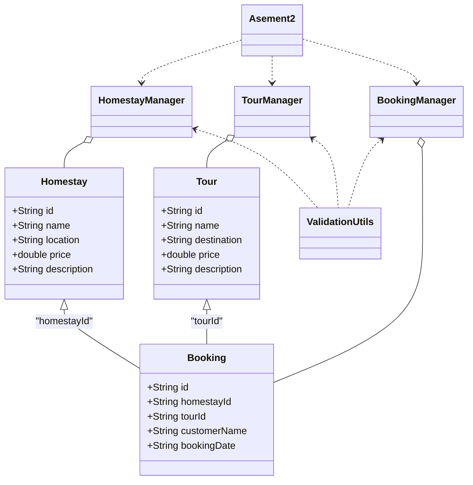
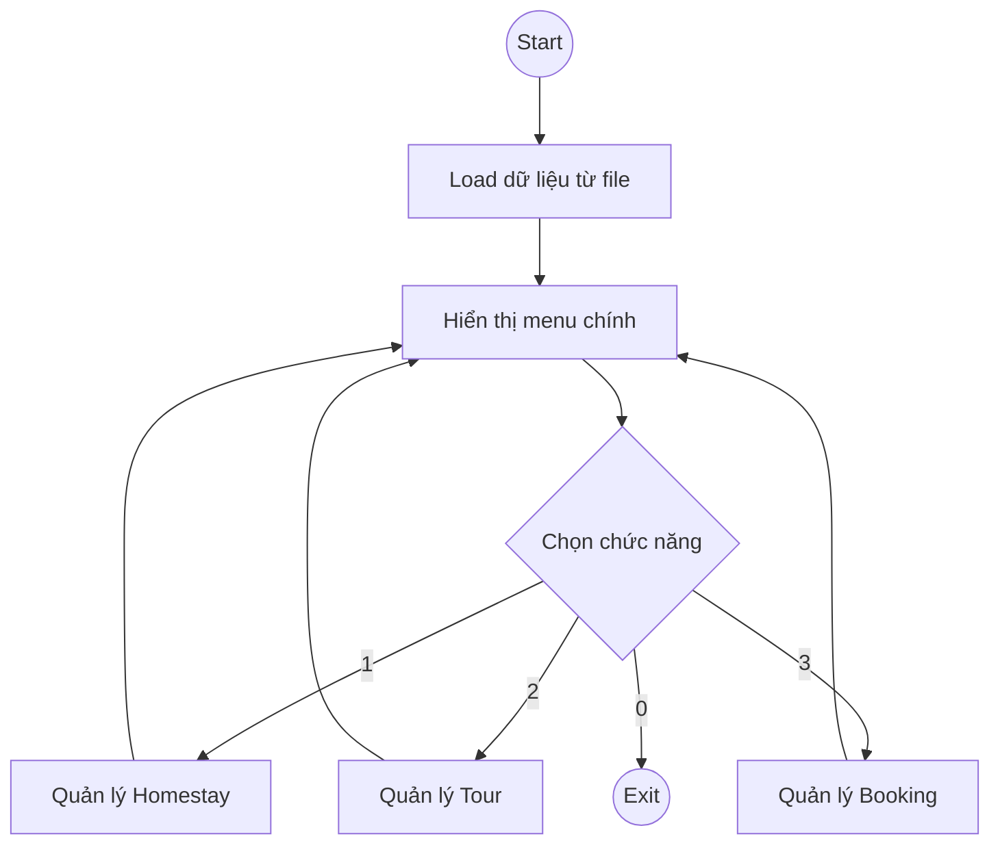

# Asement2

Mô tả: Đây là dự án Java console dùng để quản lý homestay, tour và booking (đặt chỗ). Dự án bao gồm mã nguồn, file dữ liệu mẫu và script build (Ant). Chương trình được tổ chức theo mô hình đơn giản: các lớp model đại diện dữ liệu, các lớp manager xử lý logic thao tác với file/danh sách, và lớp chính để điều khiển luồng chương trình.

Nội dung chính của README:

- Tổng quan dự án
- Yêu cầu môi trường
- Cấu trúc thư mục và mô tả file
- Hướng dẫn build và run (Windows / PowerShell)
- Định dạng file dữ liệu (input/output)
- Các tính năng chính
- Gợi ý phát triển và kiểm thử
- Lưu ý về đường dẫn/encoding
- Giấy phép & liên hệ

---

## 1. Tổng quan

Dự án "Asement2" là ứng dụng console viết bằng Java để quản lý:

- Danh sách Homestay (`Homestays.txt`)
- Danh sách Tours (`Tours.txt`)
- Danh sách Bookings (`Bookings.txt`)

Các thao tác cơ bản thường có trong manager: tạo, đọc, cập nhật, xóa (CRUD), tìm kiếm và validate dữ liệu đầu vào. Các lớp manager nằm ở package `manager`, model nằm ở package `model`. Lớp chứa phương thức `main` là `asement2.Asement2`.

## 2. Yêu cầu môi trường

- JDK 8 hoặc mới hơn (khuyến nghị JDK 11+)
- Apache Ant (nếu muốn dùng script build có sẵn)
- Hệ điều hành: Windows (hướng dẫn dưới đây dùng PowerShell)
- Đảm bảo `JAVA_HOME` trỏ đến thư mục JDK và `ant` có trong `PATH` nếu dùng Ant

## 3. Cấu trúc dự án (tóm tắt)

- `src/` - mã nguồn Java
  - `asement2/Asement2.java` — lớp `main` (entry point)
  - `manager/BookingManager.java` — logic quản lý Booking
  - `manager/HomestayManager.java` — logic quản lý Homestay
  - `manager/TourManager.java` — logic quản lý Tour
  - `model/Booking.java`, `model/Homestay.java`, `model/Tour.java` — định nghĩa mô hình dữ liệu
  - `utils/ValidationUtils.java` — các hàm kiểm tra/validate dữ liệu

- `build.xml` — script Ant (build/compile/package nếu đã cấu hình)
- `manifest.mf` — manifest (có thể dùng khi tạo JAR)
- `Homestays.txt`, `Tours.txt`, `Bookings.txt` — file dữ liệu đầu vào/đầu ra (text)
- `build/` — output được tạo bởi quá trình build (chứa `classes/` đã biên dịch)
- `test/` — thư mục chỉ ra cho test (hiện trống)

Trong `build/classes` có các file `.class` tương ứng cho từng package.

## 4. Hướng dẫn build & chạy

Lưu ý: các lệnh dưới giả định đang ở thư mục gốc dự án (chứa `build.xml`) và đang dùng PowerShell trên Windows.

1) Build bằng Ant (nếu `build.xml` đã định nghĩa target):

- Mở PowerShell và chuyển tới thư mục dự án:

  cd "c:\Users\ADMIN\OneDrive\Máy tính\LAB211\Asement2"

- Chạy Ant (mặc định target):

  ant

- Nếu `build.xml` định nghĩa target tạo JAR, sẽ có file JAR trong thư mục `dist` hoặc tương tự. Kiểm tra output của Ant để biết tên và vị trí.

2) Biên dịch và chạy trực tiếp bằng `javac`/`java` (không dùng Ant):

- Biên dịch tất cả source vào thư mục `build\classes`:

  mkdir -Force build\classes
  javac -d build\classes (Get-ChildItem -Recurse -Filter "*.java" -Path src | ForEach-Object -ExpandProperty FullName)

  (hoặc dùng đường dẫn đơn giản nếu PowerShell không hỗ trợ vòng lặp: `javac -d build\classes src\**\*.java` tùy shell)

- Chạy chương trình (entrypoint là `asement2.Asement2`):

  java -cp build\classes asement2.Asement2

3) Tạo JAR (tùy chọn):

- Nếu muốn đóng gói thành JAR và `manifest.mf` đã chỉ định `Main-Class`, có thể tạo JAR thủ công:

  jar cfm Asement2.jar manifest.mf -C build\classes .
  java -jar Asement2.jar

(Chú ý: tên file JAR và nội dung manifest có thể khác; kiểm tra `manifest.mf` trước khi đóng gói.)

## 5. Định dạng file dữ liệu

Các file `Homestays.txt`, `Tours.txt`, `Bookings.txt` được dùng làm nguồn dữ liệu. Nội dung chi tiết từng file phụ thuộc vào cách `*.java` hiện tại đọc/ghi.

- Kiểm tra trong mã nguồn (các lớp manager) để biết format chính xác khi sửa hoặc mở rộng. Thông thường các file dạng text theo dòng, mỗi dòng tương ứng một bản ghi, các trường phân tách bằng dấu phẩy hoặc ký tự khác.

- Khi thêm dữ liệu thủ công, tuân theo quy ước đã có trong file mẫu hiện có.

## 6. Các tính năng chính

- Load dữ liệu từ file vào bộ nhớ (list)
- Hiển thị danh sách Homestay/Tour/Booking
- Thêm sửa xóa record
- Tìm kiếm theo một số trường (ID, tên,...)
- Validate dữ liệu (sử dụng `ValidationUtils`)
- Lưu lại thay đổi vào file text

Chi tiết cụ thể của từng thao tác nằm ở các lớp `BookingManager`, `HomestayManager`, `TourManager`.

## 7. Bảo trì & Phát triển

Gợi ý khi mở rộng dự án:

- Tách phần IO (đọc/ghi file) thành một lớp riêng để dễ unit test
- Chuyển từ lưu trữ text sang JSON/CSV để dễ mở rộng và tương tác với hệ thống khác
- Thêm logging thay vì print console trực tiếp
- Bổ sung unit test cho các manager và utils

## 8. Kiểm thử

- Thử chạy chương trình với dữ liệu hiện có trong `Homestays.txt`, `Tours.txt`, `Bookings.txt` để đảm bảo không có lỗi IO
- Thêm các test case biên (rong rỗng, dữ liệu sai định dạng) để kiểm thử `ValidationUtils`

## 9. Lưu ý về đường dẫn & encoding

Vì đường dẫn làm việc chứa ký tự Unicode và khoảng trắng (ví dụ: `Máy tính` và `OneDrive`), một số công cụ dòng lệnh hoặc script build có thể gặp lỗi nếu không xử lý đúng encoding hoặc không được đặt trong dấu ngoặc kép. Luôn dùng dấu ngoặc kép xung quanh đường dẫn khi chạy lệnh trong PowerShell:

  cd "c:\Users\ADMIN\OneDrive\Máy tính\LAB211\Asement2"

Nếu gặp lỗi compile/run liên quan tới encoding, cân nhắc di chuyển dự án vào đường dẫn không có dấu và không có khoảng trắng, ví dụ `C:\projects\Asement2`.

## 10. License & Liên hệ

- License: (điền theo yêu cầu; hiện mặc định không có hoặc đặt một license phù hợp như MIT)
- Người liên hệ / tác giả: (điền thông tin nhóm hoặc cá nhân chịu trách nhiệm dự án)

## 11. Sơ đồ UML (Class Diagram)

## 12. Sơ đồ Flowchart luồng chính chương trình

---

Nếu muốn, có thể cập nhật README để bổ sung:

- Ví dụ input/output cụ thể (một vài dòng mẫu từ `Homestays.txt`, `Tours.txt`, `Bookings.txt`)
- Hướng dẫn chi tiết các command Ant targets (nếu biết rõ các target trong `build.xml`)
- Hướng dẫn phát triển (code style, quy ước commit)

Cần tôi chèn file `README.md` này vào thư mục gốc dự án không?
# Project2

# Project2

